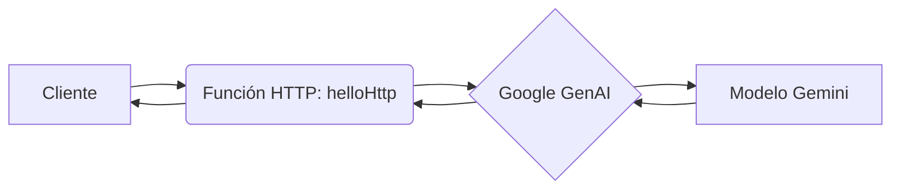

## 📄 Descripción general del proyecto

-   **Nombre del código:** Documentación de código con Gemini
-   **Versión:** 1.0
-   **Explicación general:** Este código define una función HTTP que utiliza el modelo Gemini de Google para generar documentación a partir de un fragmento de código proporcionado. La función recibe el código a documentar a través de una solicitud HTTP, lo envía al modelo Gemini, y devuelve la documentación generada como respuesta.
-   **Qué problema resuelve el código:** Automatiza la generación de documentación para código, ahorrando tiempo y esfuerzo a los desarrolladores.

## ⚙️ Visión general del sistema



-   **Tecnologías utilizadas:**
    -   Node.js
    -   Google Cloud Functions
    -   Google GenAI
-   **Dependencias:**
    -   `@google-cloud/functions-framework`
    -   `@google/genai`
-   **Requisitos del sistema:**
    -   Cuenta de Google Cloud con el API de Vertex AI habilitado.
    -   Node.js instalado.
    -   Acceso a internet para la función de Google Cloud.
-   **Prerrequisitos:**
    -   Configurar las credenciales de Google Cloud para acceder al API de Vertex AI.
    -   Tener un archivo de texto `prompt_agent.txt` con las instrucciones del sistema para el modelo Gemini.

## 📦 Guía de uso

-   **Cómo usarlo:**
    1.  Despliega la función en Google Cloud Functions.
    2.  Envía una solicitud HTTP POST a la URL de la función con un cuerpo JSON que contenga el código a documentar en el campo `code`.
    3.  La función responderá con la documentación generada por el modelo Gemini.
-   **Explicación de los pasos (entrada, salida, parámetros):**
    -   **Entrada:** Solicitud HTTP POST con un cuerpo JSON que contiene el código a documentar. El cuerpo de la solicitud debe tener la siguiente estructura:

        ```json
        {
            "code": "código a documentar"
        }
        ```

        Si el campo `code` no está presente, se utilizará el valor por defecto definido en la variable `defaultCode`.
    -   **Salida:** Respuesta HTTP con la documentación generada por el modelo Gemini en el cuerpo de la respuesta. La respuesta tendrá un código de estado 200 si la documentación se generó correctamente, o un código de estado 500 si ocurrió un error.
    -   **Parámetros:** No hay parámetros de consulta relevantes. El código a documentar se pasa en el cuerpo de la solicitud POST.
-   **Caso de uso de ejemplo:**

    ```javascript
    const axios = require('axios');

    async function documentCode(code) {
      try {
        const response = await axios.post('https://[URL_DE_TU_FUNCION].cloudfunctions.net/helloHttp', { code: code });
        console.log(response.data);
      } catch (error) {
        console.error('Error:', error);
      }
    }

    const codeExample = `
    function add(a, b) {
      return a + b;
    }
    `;

    documentCode(codeExample);
    ```

## 🔐 Documentación de la API

-   **Endpoints:**
    -   `POST /helloHttp`: Recibe el código a documentar y devuelve la documentación generada.
-   **Formatos de solicitud y respuesta:**
    -   **Solicitud:**
        -   Método: POST
        -   Encabezados: `Content-Type: application/json`
        -   Cuerpo: JSON con el campo `code` que contiene el código a documentar.
    -   **Respuesta:**
        -   Código de estado: 200 OK si la documentación se generó correctamente, 500 Internal Server Error si ocurrió un error.
        -   Encabezados: `Content-Type: text/plain`
        -   Cuerpo: Texto plano con la documentación generada.
-   **Autenticación y autorización:**
    -   La función está configurada para permitir solicitudes desde cualquier origen mediante los encabezados CORS. No requiere autenticación ni autorización adicionales.

## 📚 Referencias

-   [Google Cloud Functions](https://cloud.google.com/functions)
-   [Google GenAI](https://ai.google.dev/)
-   [Vertex AI](https://cloud.google.com/vertex-ai)
-   [CORS (Cross-Origin Resource Sharing)](https://developer.mozilla.org/en-US/docs/Web/HTTP/CORS)
